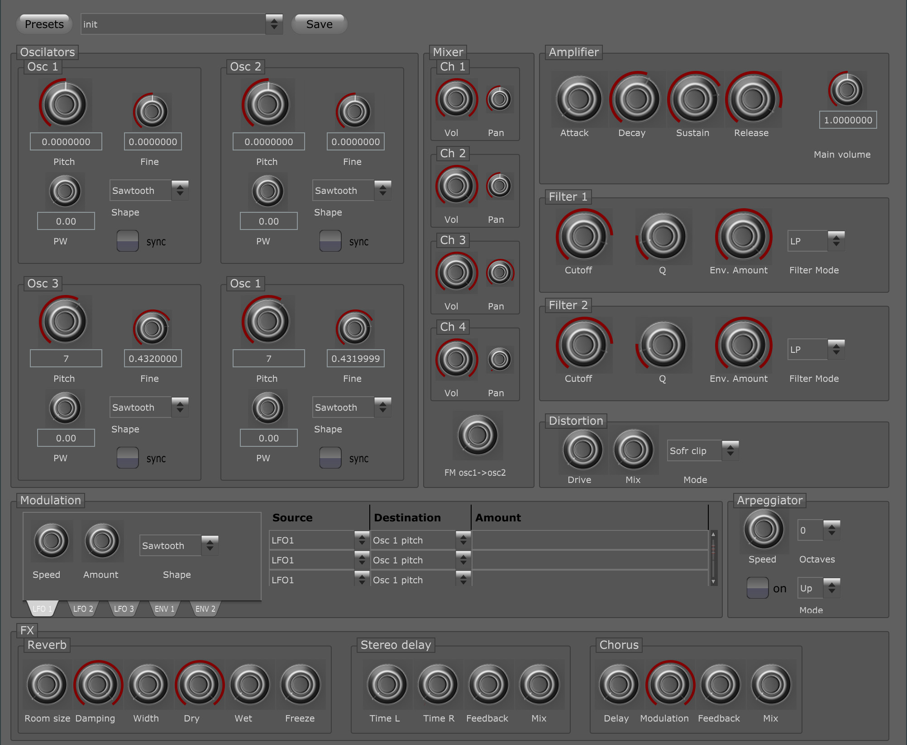

# Lupo

Lupo is a virtual analogue synth with 4 oscillators.

## Features

* 4 Oscillators with sync, 3 waveforms and noise
* 4 channel mixer with individual pan for each oscillator
* 6 way modulation matrix with 5 sources and six targets
* 3 LFOs with different wave forms
* 2 Filters with highpass and lowpass mode
* 2 Modulation envelopes
* 4 Effects: Chorus, Stereo Delay, Reverb and Distortion

## Notice

Although it's already usable, the project is in early development state. If you intend to create patches for the synth, they might not work in later versions. 

### Known issues

* Fiddling with the modulation matrix causes sometimes crashes
* Not all parameters are clamped to meaningful ranges, which leads to strange sounds
* PWM is not working at all
* the sync button makes only sense for the second oscillator
* The arpeggiator is not tempo syncable

## What is planned?

In the next weeks I'll finish the PWM section, work on stability and provide
a bunch of nice patches.

## Getting Started

Take the VS2017 project from the Builds folder, currently only Visual Studio 2017 is available.

## License

This project is licensed under the GPL v3 License

